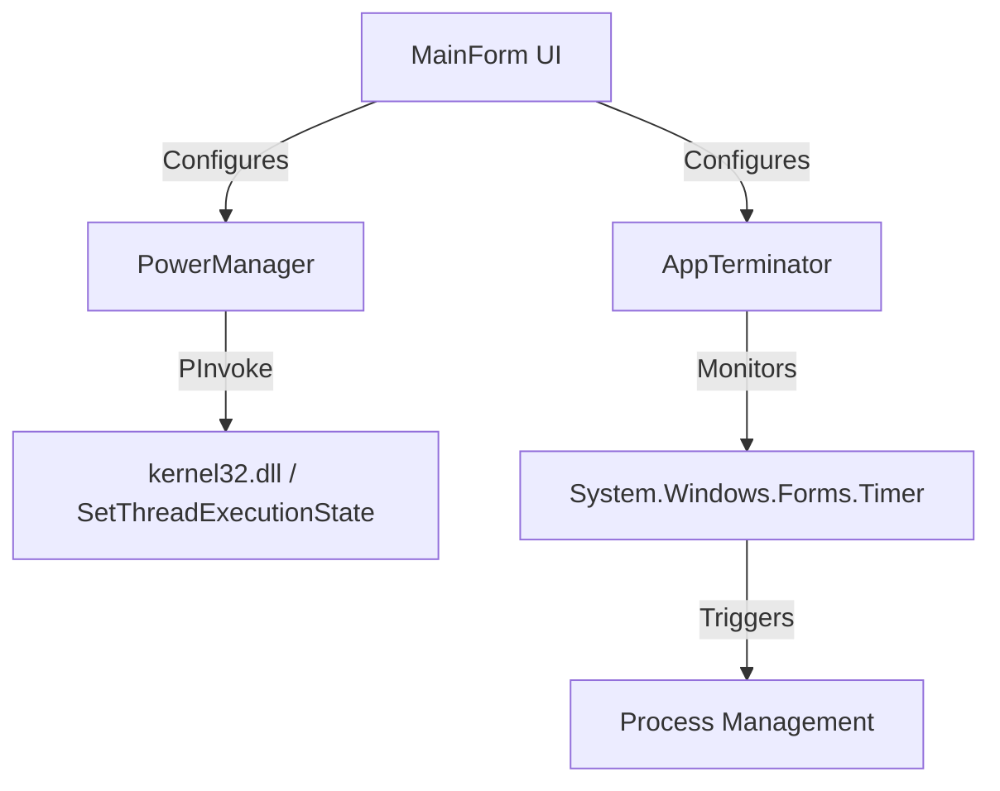

# Technical Design Document - Stay Awake Utility

## 1. Overview
A lightweight Windows desktop application effectively managing power states and process lifecycles. It allows users to prevent system sleep and schedule automatic closure of specific applications.

## 2. Technology Stack
- **Language**: C# 13 / 14 (latest supported by .NET 10)
- **Framework**: .NET 10 (LTS)
- **UI Framework**: Windows Forms (WinForms)
  - *Rationale*: Lowest memory footprint (~20MB RAM) compared to WPF (~60MB) or MAUI/Electron (>100MB). Native look and feel, excellent performance.
- **Distribution**: Single-file executable (Trimmed) for ease of deployment.

## 3. Core Features & Architecture

### 3.1. Sleep Prevention
**Mechanism**: Win32 API `SetThreadExecutionState`.
- **Flag**: `ES_CONTINUOUS | ES_SYSTEM_REQUIRED | ES_DISPLAY_REQUIRED`
- **Behavior**:
  - The app will call this API to reset the system idle timer.
  - When the timer expires, the app will clear the flags (`ES_CONTINUOUS`).

### 3.2. Process Terminator
**Mechanism**: `System.Diagnostics.Process` API.
- **Input**: Process name (selector from running processes list).
- **Behavior**:
  - A timer counts down.
  - On zero, `Process.GetProcessesByName()` finds the target.
  - Calls `Kill()` on matching processes.

### 3.3. Architecture Diagram


## 4. UI Design
A simple single-window interface.
- **Top Section**: "Stay Awake" toggle & Duration (Dropdown: 30m, 1h, 2h, Indefinite).
- **Bottom Section**: "Kill App" toggle, Target App (ComboBox), Duration.
- **Status Bar**: showing current active rules.

## 5. Win32 API Details
```csharp
[Flags]
public enum EXECUTION_STATE : uint
{
    ES_AWAYMODE_REQUIRED = 0x00000040,
    ES_CONTINUOUS = 0x80000000,
    ES_DISPLAY_REQUIRED = 0x00000002,
    ES_SYSTEM_REQUIRED = 0x00000001
}

[DllImport("kernel32.dll", CharSet = CharSet.Auto, SetLastError = true)]
static extern EXECUTION_STATE SetThreadExecutionState(EXECUTION_STATE esFlags);
```

## 6. Resource Efficiency Plan
- **Event-Driven**: Use `System.Windows.Forms.Timer` (runs on UI thread message loop) instead of `Thread.Sleep` loops to minimize CPU context switching.
- **Stateless**: Logic will not cache process handles, it will lookup only when needed to avoid stale handles.

## 7. Security considerations
- Needs standard user privileges.
- Closing external apps requires the target app to be owned by the same user, or the utility must be run as Admin. We will target same-user scope by default.
