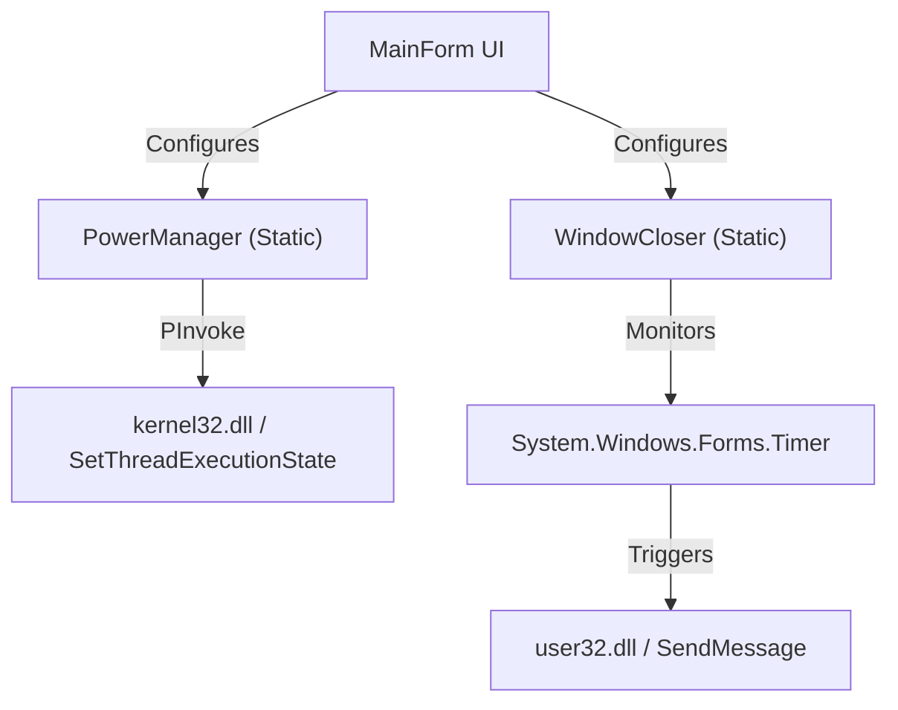

# Technical Design Document - Stay Awake Utility

## 1. Overview
A lightweight Windows desktop application effectively managing power states and process lifecycles. It allows users to prevent system sleep and schedule automatic closure of specific applications.

## 2. Technology Stack
- **Language**: C# 13 / 14 (latest supported by .NET 10)
- **Framework**: .NET 10 (LTS)
- **UI Framework**: Windows Forms (WinForms)
  - *Rationale*: Lowest memory footprint (~20MB RAM) compared to WPF (~60MB) or MAUI/Electron (>100MB). Native look and feel, excellent performance.
- **Distribution**: Framework-dependent executable.

## 3. Core Features & Architecture

### 3.1. Sleep Prevention
**Mechanism**: Win32 API `SetThreadExecutionState`.
- **Modes**:
  - **Require Display**: Keeps system running and display on (`ES_CONTINUOUS | ES_SYSTEM_REQUIRED | ES_DISPLAY_REQUIRED`).
  - **Require System**: Keeps system running but allows display to sleep (`ES_CONTINUOUS | ES_SYSTEM_REQUIRED`).
- **Behavior**:
  - The app will call this API to reset the system idle timer.
  - When the timer expires or the user stops it, the app will clear the flags (`ES_CONTINUOUS`).
- **Durations**: 30 minutes to 8 hours (15-minute increments). Default: 2 hours.

### 3.2. Window Closer
**Mechanism**: Win32 API `SendMessage` with `WM_CLOSE`.
- **Input**: Window Title (selected from a list of open windows).
- **Behavior**:
  - A timer counts down.
  - On zero, the app finds the target window handle.
  - Sends `WM_CLOSE` message to gracefully close the window.
  - Updates the GroupBox text with closure details (Handle, Time, Process Name).
- **Durations**: 15 minutes to 8 hours (15-minute increments). Default: 1 hour.

### 3.3. Architecture Diagram


### 3.4. Single Instance Enforcement
**Mechanism**: `System.Threading.Mutex` + `System.Threading.EventWaitHandle`.
- **Logic**:
  - Validates a named mutex on startup.
  - If mutex exists (application is already running):
    - Opens a named `EventWaitHandle`.
    - Signals the event to notify the existing instance.
    - The existing instance (listening on a background thread) receives the signal, invokes the UI thread to restore the window and bring it to the foreground.
    - The new instance terminates immediately.

## 4. UI Design
A simple single-window interface (`FixedSingle`, Non-resizable).
- **Top Section (Stay Awake)**:
  - "Require Display" / "Stop Require Display" Button.
  - "Require System" / "Stop Require System" Button.
  - Duration Dropdown (Disabled when active).
  - Remaining Time Label.
- **Bottom Section (Window Closer)**:
  - List of open windows (ListBox).
  - "Refresh" Button.
  - Process Name and Window Handle text fields (Read-only display).
  - "Close Window" / "Stop" Button.
  - Duration Dropdown (Disabled when active).
  - Remaining Time Label.

### 4.1. System Tray Interaction
- **Close Button**: Does NOT quit the application; minimizes it to the system tray.
- **Tray Icon**:
  - **Left Click**: Restores and shows the main window.
  - **Right Click**: Context menu with:
    - **Show**: Restores window.
    - **Quit**: Fully terminates the application.

## 5. Win32 API Details
```csharp
[Flags]
public enum EXECUTION_STATE : uint
{
    ES_AWAYMODE_REQUIRED = 0x00000040,
    ES_CONTINUOUS = 0x80000000,
    ES_DISPLAY_REQUIRED = 0x00000002,
    ES_SYSTEM_REQUIRED = 0x00000001
}

[DllImport("kernel32.dll", CharSet = CharSet.Auto, SetLastError = true)]
static extern EXECUTION_STATE SetThreadExecutionState(EXECUTION_STATE esFlags);

[DllImport("user32.dll", CharSet = CharSet.Auto)]
private static extern IntPtr SendMessage(IntPtr hWnd, UInt32 Msg, IntPtr wParam, IntPtr lParam);

private const UInt32 WM_CLOSE = 0x0010;

// Window Enumeration & Info
[DllImport("user32.dll")]
public static extern bool EnumWindows(EnumWindowsProc lpEnumFunc, IntPtr lParam);

[DllImport("user32.dll", CharSet = CharSet.Unicode)]
public static extern int GetWindowText(IntPtr hWnd, StringBuilder lpString, int nMaxCount);

[DllImport("user32.dll")]
public static extern bool IsWindowVisible(IntPtr hWnd);

[DllImport("user32.dll")]
public static extern IntPtr GetShellWindow();

[DllImport("user32.dll")]
public static extern uint GetWindowThreadProcessId(IntPtr hWnd, out uint lpdwProcessId);

```

## 6. Resource Efficiency Plan
- **Event-Driven**: Use `System.Windows.Forms.Timer` (runs on UI thread message loop) instead of `Thread.Sleep` loops to minimize CPU context switching.
- **Stateless**: Logic will not cache process handles long-term; it resolves them as needed.

## 7. Security considerations
- Needs standard user privileges.
- Closing external apps requires the target app to be owned by the same user, or the utility must be run as Admin. We will target same-user scope by default.
